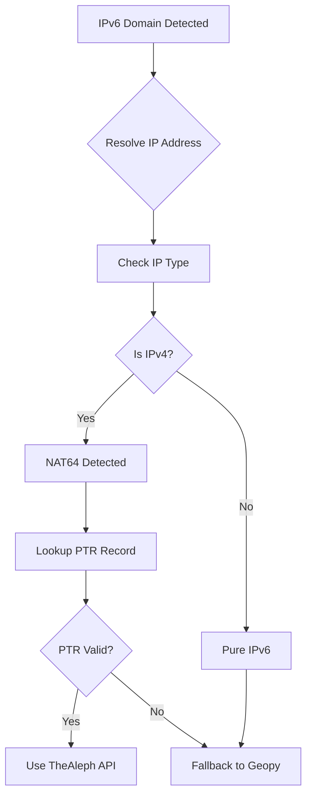

# TheAleph IPv6 Support and Technical Documentation

## Overview

This document provides comprehensive technical details about TheAleph API integration in the Netflix OCA Locator, focusing on IPv6 support and intelligent fallback mechanisms.

## Table of Contents

1. [IPv6 Domain Support](#ipv6-domain-support)
2. [NAT64 Detection and Handling](#nat64-detection-and-handling)
3. [PTR Record Analysis](#ptr-record-analysis)
4. [Fallback Strategies](#fallback-strategies)
5. [Implementation Examples](#implementation-examples)
6. [Technical Reference](#technical-reference)


## IPv6 Domain Support

### The Challenge

TheAleph API currently does not support IPv6 addresses directly. However, Netflix OCA infrastructure includes IPv6-enabled servers with domains containing "ipv6" in their names. This requires intelligent handling to provide accurate geolocation data.

### Domain Detection Algorithm

```python
def is_ipv6_domain(domain: str) -> bool:
    """
    Detect if a domain is IPv6-related based on naming convention.
    
    Netflix IPv6 OCA domains typically contain 'ipv6' in the hostname.
    Example: ipv6-c001-ord001-ix.1.oca.nflxvideo.net
    """
    return "ipv6" in domain.lower()
```

### IP Type Detection

```python
def detect_ip_type(ip_address: str) -> str:
    """
    Determine if an IP address is IPv4, IPv6, or unknown.
    
    Returns:
        "ipv4" - Contains dots but no colons (e.g., "192.168.1.1")
        "ipv6" - Contains colons (e.g., "2001:db8::1")
        "unknown" - Cannot determine type
    """
    if "." in ip_address and ":" not in ip_address:
        return "ipv4"
    elif ":" in ip_address:
        return "ipv6"
    else:
        return "unknown"
```

## NAT64 Detection and Handling

### What is NAT64?

NAT64 is a mechanism that allows IPv6-only clients to contact IPv4 servers. In the context of Netflix OCAs:

1. An IPv6 domain might resolve to an IPv4 address (NAT64 scenario)
2. This IPv4 address can be used for PTR record lookups
3. The PTR record can then be used with TheAleph API

### NAT64 Processing Flow



### Implementation Logic

```python
async def handle_ipv6_domain(domain: str, ip_address: str, asn: str) -> dict:
    """
    Handle IPv6 domains with NAT64 support.
    """
    if detect_ip_type(ip_address) == "ipv4":
        # NAT64 scenario - IPv6 domain resolved to IPv4
        ptr_record = await get_ptr_record(ip_address)
        
        if ptr_record and ":" not in ptr_record:
            # Valid PTR record for TheAleph
            return await thealeph_api_call(ptr_record, asn)
    
    # Fallback for pure IPv6 or invalid PTR
    return await geopy_fallback(domain)
```

## PTR Record Analysis

### PTR Record Lookup

PTR (Pointer) records map IP addresses to domain names. For Netflix OCAs:

```python
async def get_ptr_record(ip_address: str) -> str | None:
    """
    Perform reverse DNS lookup to get PTR record.
    
    Example:
        Input: "45.57.120.66"
        Output: "ipv4-c211-ord001-dev-ix.1.oca.nflxvideo.net"
    """
    try:
        loop = asyncio.get_event_loop()
        ptr_record = await loop.run_in_executor(
            None, socket.gethostbyaddr, ip_address
        )
        return ptr_record[0]
    except socket.herror:
        return None
```

### PTR Record Validation

```python
def is_valid_ptr_for_thealeph(ptr_record: str) -> bool:
    """
    Validate if a PTR record is suitable for TheAleph API.
    
    Invalid conditions:
    - Contains ":" (IPv6 indicator)
    - Is None or empty
    - Contains invalid characters
    """
    if not ptr_record:
        return False
    
    if ":" in ptr_record:
        return False
        
    # Additional validation can be added
    return True
```

## Fallback Strategies

### Hierarchical Fallback System

1. **Primary**: TheAleph API with original ASN
2. **Secondary**: TheAleph API with Netflix ASN (2906)
3. **Tertiary**: Geopy standard geocoding
4. **Final**: Return unknown location gracefully

### IPv6-Specific Fallback

```python
async def resolve_location_with_ipv6_support(
    domain: str, 
    asn: str, 
    ip_address: str
) -> dict:
    """
    Resolve location with full IPv6 support and fallback chain.
    """
    # Check if IPv6 domain
    if is_ipv6_domain(domain):
        # Special handling for IPv6
        if detect_ip_type(ip_address) == "ipv4":
            # NAT64 case - try PTR lookup
            ptr_record = await get_ptr_record(ip_address)
            
            if is_valid_ptr_for_thealeph(ptr_record):
                # Try TheAleph with PTR record
                result = await try_thealeph(ptr_record, asn)
                if result:
                    return result
                    
                # Fallback to Netflix ASN
                result = await try_thealeph(ptr_record, "2906")
                if result:
                    return result
        
        # IPv6 or failed PTR - use geopy
        return await geopy_fallback(domain)
    
    # Standard IPv4 domain handling
    return await standard_thealeph_flow(domain, asn, ip_address)
```

## Implementation Examples

### Complete IPv6 Handler

```python
class IPv6AwareGeocodeService:
    """
    Geocoding service with full IPv6 support.
    """
    
    async def resolve_domain_location(
        self, 
        domain: str, 
        asn: str | None = None, 
        ip_address: str | None = None
    ) -> dict | None:
        """
        Resolve domain location with IPv6 awareness.
        """
        # Detect domain type
        if self._is_ipv6_domain(domain):
            return await self._handle_ipv6_domain(domain, asn, ip_address)
        else:
            return await self._handle_ipv4_domain(domain, asn, ip_address)
    
    def _is_ipv6_domain(self, domain: str) -> bool:
        """Check if domain is IPv6-related."""
        return "ipv6" in domain.lower()
    
    async def _handle_ipv6_domain(
        self, 
        domain: str, 
        asn: str, 
        ip_address: str
    ) -> dict | None:
        """
        Handle IPv6 domains with NAT64 support.
        """
        # Check if NAT64 (IPv4 address for IPv6 domain)
        if ip_address and "." in ip_address and ":" not in ip_address:
            # Try PTR lookup
            ptr_record = await self.ip_service.get_ptr_record(ip_address)
            
            if ptr_record and ":" not in ptr_record:
                # Valid PTR for TheAleph
                logger.debug(f"Using PTR record {ptr_record} for IPv6 domain {domain}")
                
                # Try with original ASN
                result = await self.thealeph_service.resolve_domain_location(
                    ptr_record, asn, ip_address
                )
                if result:
                    result["original_domain"] = domain
                    result["nat64_detected"] = True
                    return result
                
                # Try with Netflix ASN
                result = await self.thealeph_service.resolve_domain_location(
                    ptr_record, "2906", ip_address
                )
                if result:
                    result["original_domain"] = domain
                    result["nat64_detected"] = True
                    return result
        
        # Fallback to geopy for pure IPv6 or failed PTR
        logger.debug(f"Using geopy fallback for IPv6 domain {domain}")
        return await self.geopy_service.extract_location_from_domain(domain)
```

### Testing IPv6 Support

```python
# Test cases for IPv6 support
test_cases = [
    {
        "domain": "ipv6-c001-ord001-ix.1.oca.nflxvideo.net",
        "ip": "2001:db8::1",  # Pure IPv6
        "expected_flow": "geopy_fallback"
    },
    {
        "domain": "ipv6-c001-ord001-ix.1.oca.nflxvideo.net",
        "ip": "45.57.120.66",  # NAT64 IPv4
        "expected_flow": "ptr_lookup -> thealeph"
    },
    {
        "domain": "ipv4-c001-ord001-ix.1.oca.nflxvideo.net",
        "ip": "45.57.120.66",  # Standard IPv4
        "expected_flow": "direct_thealeph"
    }
]
```

## Technical Reference

### Configuration Options

```python
# Environment variables for IPv6 support
NETFLIX_OCA_ENABLE_IPV6_SUPPORT=true
NETFLIX_OCA_IPV6_FALLBACK_TIMEOUT=5.0
NETFLIX_OCA_PTR_LOOKUP_TIMEOUT=2.0
```

### Error Handling

```python
class IPv6GeocodeError(Exception):
    """Raised when IPv6 geocoding fails."""
    pass

class NAT64DetectionError(Exception):
    """Raised when NAT64 detection fails."""
    pass

class PTRLookupError(Exception):
    """Raised when PTR record lookup fails."""
    pass
```

### Performance Considerations

1. **PTR Lookups**: Add timeout to prevent hanging on failed lookups
2. **Caching**: Consider caching PTR records for repeated queries
3. **Parallel Processing**: IPv6 and IPv4 domains can be processed in parallel
4. **Fallback Speed**: Quick fallback to geopy for known IPv6 scenarios

### Future Improvements

1. **Direct IPv6 Support**: When TheAleph adds IPv6 support, update the integration
2. **IPv6 Geolocation Database**: Consider adding dedicated IPv6 location data
3. **Enhanced NAT64 Detection**: Improve detection algorithms
4. **PTR Record Caching**: Implement intelligent caching for performance

## Conclusion

This implementation provides robust IPv6 support for Netflix OCA location discovery while maintaining compatibility with TheAleph API limitations. The intelligent fallback system ensures accurate results regardless of network configuration, supporting both pure IPv6 and NAT64 scenarios.

For updates and contributions, please refer to the main project repository.